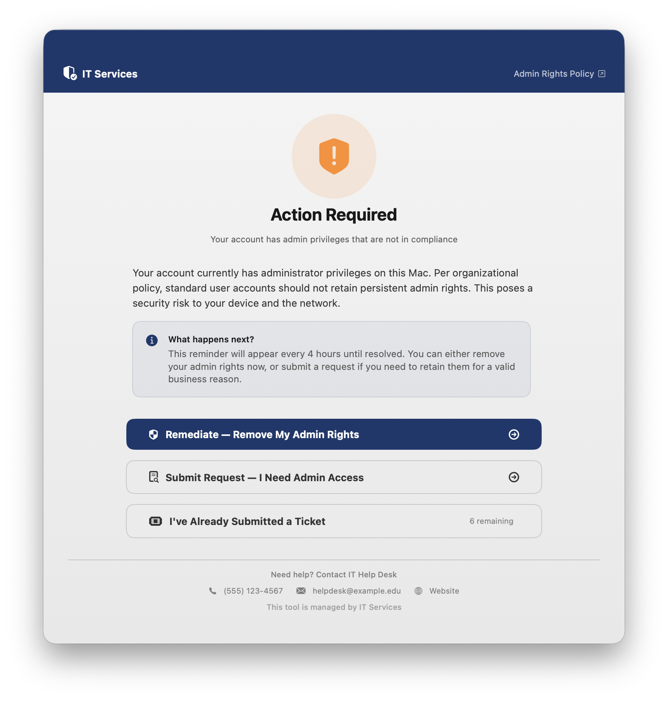
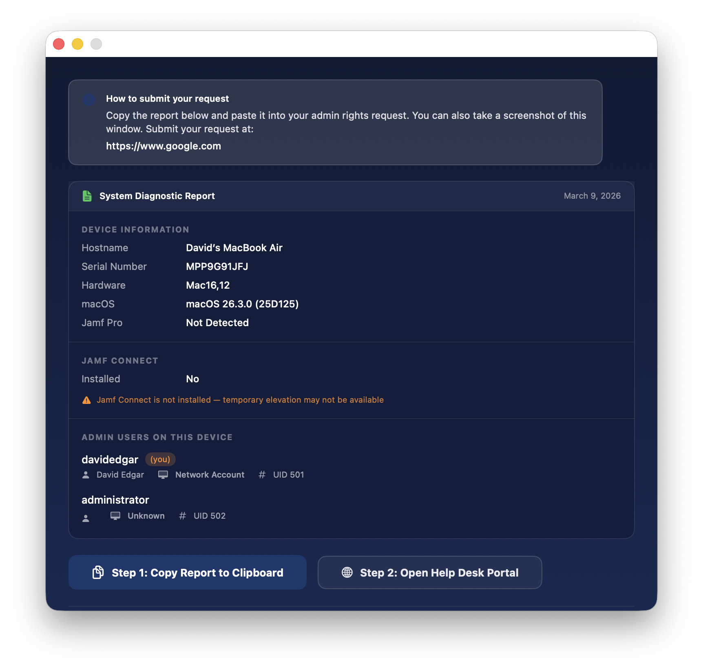
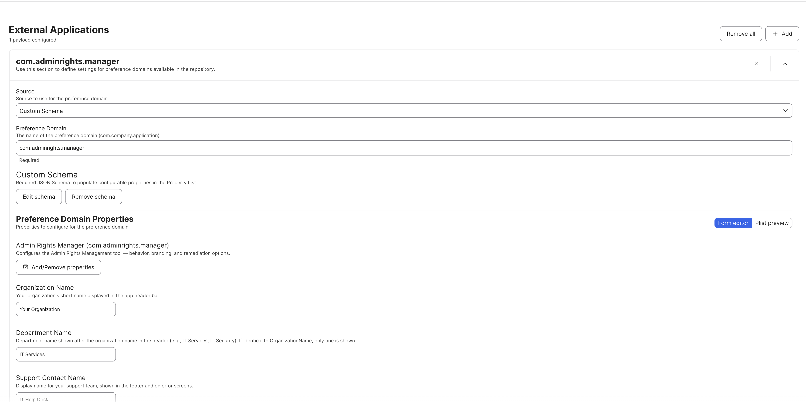

# Admin Rights Manager

A macOS tool for managing and remediating unauthorized admin privileges. Deployed as a signed and notarized `.pkg` via MDM (Jamf Pro, Mosyle, Kandji, etc.), it detects users with admin rights, presents a compliance nag window on a recurring schedule, and provides self-service remediation or an elevation request workflow.

Fully white-label — customize branding, colors, logos, messaging, and support URLs via MDM configuration profiles.

## Screenshots

### Compliance Nag Screen
The main window shown to users with admin rights. Displays your organization's policy message and presents three options: self-remediate, submit a request for continued access, or defer with an existing ticket. The "I've Already Submitted a Ticket" button tracks remaining uses (configurable via `MaxTicketDeferrals`). The window follows macOS system appearance for light and dark mode.



### Diagnostic Report
If the user clicks "Submit Request," a full system diagnostic report is generated with device info, admin user details, and Jamf Connect status. The user copies the report to clipboard, then opens the help desk portal to paste it into their request.



## How It Works

Admin Rights Manager has three components that work together:

- **LaunchAgent** — Runs in the logged-in user's session. Launches the app at login and on a recurring interval (default: every 4 hours). Installed to `/Library/LaunchAgents/`.
- **App** (`AdminRightsManager.app`) — A SwiftUI window that checks whether the current user has admin rights. If they do, it displays a branded compliance nag with options to self-remediate or submit a request for continued access. If the user is not an admin, the app quits immediately. Installed to `/Library/Application Support/AdminRightsManager/`. Hidden from the Dock via `LSUIElement`.
- **Privileged Helper** — A LaunchDaemon running as root that performs the actual admin rights removal using `dseditgroup`. The app communicates with it via a file-based signal in `/Library/Application Support/AdminRightsManager/`. Installed to `/Library/PrivilegedHelperTools/`. After successful remediation, the helper also performs a full self-uninstall of all components (audit log preserved).

### User Flow

1. The LaunchAgent opens the app on a recurring schedule
2. The app checks if the current user has admin rights — if not, it quits silently
3. If they do, the **compliance nag screen** is displayed (screenshot above). When `AllowDeferral` is false (the default), the window is persistent — it floats above all other windows and cannot be closed, minimized, hidden, or quit via keyboard shortcuts
4. The user chooses one of three options:
   - **Remediate**: A confirmation dialog appears. On confirm, the privileged helper removes admin rights via `dseditgroup`. A remediation receipt is shown with the user's details, device serial, timestamp, and a reference ID. The user can copy this receipt for their records. After clicking "OK" (or a 30-second auto-close), the tool uninstalls itself from the machine.
   - **Submit Request**: A diagnostic report is generated (screenshot above) with device info, admin user list, and Jamf Connect status. The user copies the report and opens the help desk portal to request continued access.
   - **I've Already Submitted a Ticket**: Dismisses the window until the next LaunchAgent cycle. This option has a limited number of uses (default: 10, configurable via `MaxTicketDeferrals`). The remaining count is shown on the button and persists across launches. Once exhausted, the button disappears.

## Requirements

- macOS 13.0 (Ventura) or later
- MDM solution capable of deploying `.pkg` files and configuration profiles
- Apple Developer ID certificates for signing (Application + Installer)

## Building the PKG

### Automated (GitHub Actions)

The repository includes a GitHub Actions workflow that builds, signs, notarizes, and publishes the `.pkg` automatically.

**Trigger via tag:**

```bash
git tag -a v1.0.1 -m "Release v1.0.1"
git push origin v1.0.1
```

**Trigger manually:** Go to Actions → "Build & Sign PKG" → "Run workflow" and enter a version number.

The workflow produces a signed, notarized `.pkg` attached as both a build artifact and a GitHub Release.

**Required repository secrets:**

| Secret | Description |
|--------|-------------|
| `DEVELOPER_ID_APP_CERTIFICATE_P12` | Base64-encoded Developer ID Application `.p12` |
| `DEVELOPER_ID_INSTALLER_CERTIFICATE_P12` | Base64-encoded Developer ID Installer `.p12` |
| `CERTIFICATE_PASSWORD` | Export password for the `.p12` files |
| `KEYCHAIN_PASSWORD` | Any random string (temporary keychain on the runner) |
| `DEVELOPER_ID_NAME` | Signing identity name, e.g. `Your Name (TEAMID)` |
| `APPLE_ID` | Apple ID email for notarization |
| `APPLE_APP_SPECIFIC_PASSWORD` | App-specific password from appleid.apple.com |
| `APPLE_TEAM_ID` | 10-character Apple Developer Team ID |

### Manual

1. Open `AdminRightsManager.xcodeproj` in Xcode 16+
2. Build the `AdminRightsManager` scheme (Release configuration)
3. Build the `com.adminrights.manager.helper` scheme (Release configuration)
4. Run the build script from the project root:

```bash
./Scripts/build-pkg.sh 1.0.1
```

The output `.pkg` will be in `./build/`. Sign and notarize it before deploying.

## Deploying via MDM

### Step 1: Upload the PKG

Upload `AdminRightsManager-x.x.x.pkg` to your MDM as a package. In Jamf Pro, this goes under Settings → Packages.

The pkg handles everything automatically during installation — no manual steps are needed beyond uploading and scoping. The built-in install scripts perform the following:

- **Preinstall**: Stops any existing LaunchDaemon, LaunchAgent, and running app instance (safe for upgrades)
- **Postinstall**: Sets correct ownership and permissions (`root:wheel`) on all components, loads the LaunchDaemon (privileged helper) via `launchctl bootstrap`, loads the LaunchAgent for the current console user, and launches the app immediately for a first-run experience. If no user is logged in at install time, the LaunchAgent activates at next login.

### Step 2: Deploy the Configuration Profile

The `ConfigProfile/` directory contains two files for configuring the tool:

- **`com.adminrights.manager.mobileconfig`** — A ready-to-edit XML configuration profile template. Update the values for your organization, generate new `PayloadUUID` values using `uuidgen` in Terminal, then upload to your MDM targeting the `com.adminrights.manager` preference domain.
- **`com.adminrights.manager.json`** — A Jamf Pro JSON Schema file. In Jamf Pro, go to Configuration Profiles → Application & Custom Settings → External Applications → Add → Custom Schema. Enter `com.adminrights.manager` as the preference domain, click Add Schema, and paste the contents of this JSON file. Jamf Pro will render a GUI form for all configurable keys — no manual XML editing needed.



At minimum, update: `OrganizationName`, `SupportContactName`, `SupportEmail`, and `PolicyMessage`. Scope the profile to the same group as the PKG.

All keys are optional — the app uses sensible defaults for anything not specified in the profile.

#### Preference Domain Reference

The preference domain is `com.adminrights.manager`. The following keys are available:

| Key | Type | Default | Description |
|-----|------|---------|-------------|
| `OrganizationName` | String | `Your Organization` | Organization name displayed in the header bar |
| `DepartmentName` | String | `IT Services` | Department name shown after org name in the header |
| `SupportContactName` | String | `IT Help Desk` | Display name for your support team |
| `SupportPhone` | String | `(555) 123-4567` | Clickable phone number in the footer (empty to hide) |
| `SupportEmail` | String | `helpdesk@example.edu` | Clickable email link in the footer (empty to hide) |
| `SupportWebsiteURL` | String | `https://it.example.edu` | IT website link in the footer (empty to hide) |
| `SupportRequestURL` | String | `https://helpdesk.example.edu/request` | Help desk portal URL for the "Open Help Desk Portal" button |
| `PolicyURL` | String | `https://it.example.edu/policies/admin-rights` | Link to the full policy document shown in the header |
| `PolicyMessage` | String | *(default text)* | Warning text shown to users explaining why they need to remediate |
| `AccentColorHex` | String | `#1b386d` | Brand accent color as a hex value — buttons, links, and highlights. All other UI colors are derived automatically for light and dark mode |
| `LogoImagePath` | String | *(empty)* | Absolute path to a custom logo PNG on disk (empty = default shield icon) |
| `NagIntervalSeconds` | Integer | `14400` | Display interval in seconds (the actual interval is controlled by the LaunchAgent plist) |
| `AllowDeferral` | Boolean | `false` | Allow users to close the window without acting. When false, the window is persistent and unclosable |
| `GracePeriodDays` | Integer | `0` | Days before forced remediation (0 = nag-only, never force) |
| `ShowSubmitRequestOption` | Boolean | `true` | Show the "Submit Request — I Need Admin Access" button |
| `MaxTicketDeferrals` | Integer | `10` | Max uses of "I've Already Submitted a Ticket" before the button disappears (0 = hide entirely) |
| `JamfConnectAppPath` | String | `/Applications/Jamf Connect.app` | Path to detect Jamf Connect for the diagnostic report |
| `JamfConnectElevationURL` | String | *(empty)* | Jamf Connect elevation workflow URL (empty if not using) |
| `EnableLocalAuditLog` | Boolean | `true` | Write a local audit log of remediation actions |
| `AuditLogPath` | String | `/Library/Logs/AdminRightsManager.log` | File path for the local audit log |

### Step 3: Create a Smart Group

Create a smart group in your MDM that targets machines where the logged-in user has admin rights. Scope both the PKG policy and the configuration profile to this group.

### Step 4: Automatic Cleanup

After a user successfully remediates, the tool automatically cleans itself up. When the user clicks "OK" on the remediation receipt screen, the app signals the privileged helper to perform a full self-uninstall: it unloads the LaunchAgent, removes the app bundle and support files, then unloads itself and removes the LaunchDaemon and helper binary. The audit log at `/Library/Logs/AdminRightsManager.log` is deliberately preserved for compliance records.

No separate uninstall policy is needed for remediated users. However, `Scripts/uninstall.sh` is still available if you need to force-remove the tool from machines via MDM independently of the remediation flow.

## File Locations

| Component | Path |
|-----------|------|
| App bundle | `/Library/Application Support/AdminRightsManager/AdminRightsManager.app` |
| Privileged helper | `/Library/PrivilegedHelperTools/com.adminrights.manager.helper` |
| LaunchDaemon plist | `/Library/LaunchDaemons/com.adminrights.manager.helper.plist` |
| LaunchAgent plist | `/Library/LaunchAgents/com.adminrights.manager.plist` |
| Audit log | `/Library/Logs/AdminRightsManager.log` |
| Helper stdout log | `/Library/Logs/AdminRightsManager-helper.log` |

## License

See [LICENSE](LICENSE) for details.
